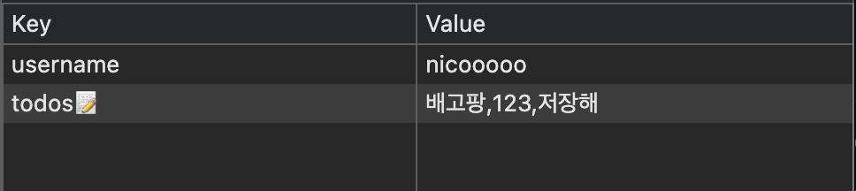
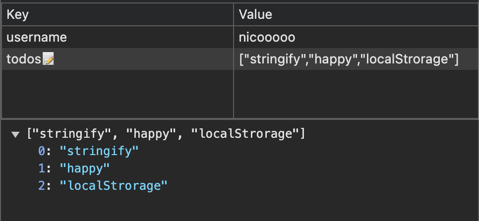
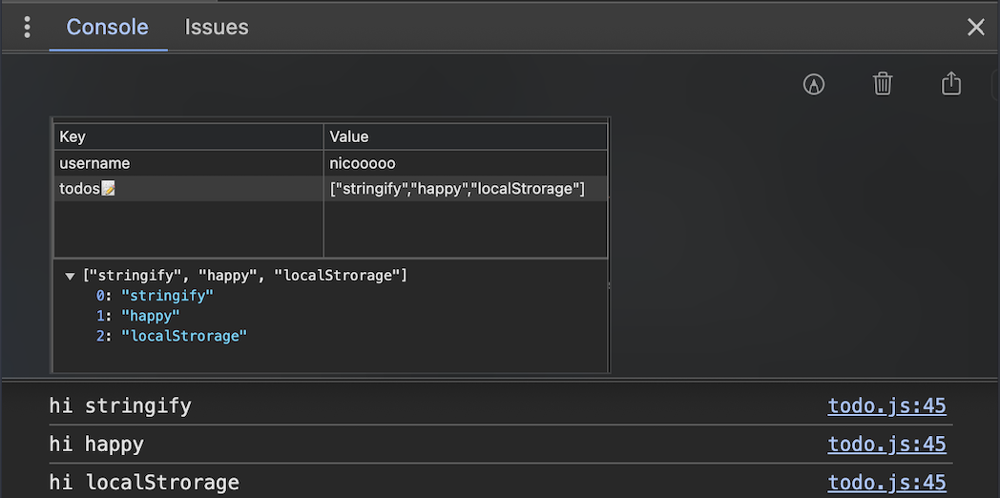

# Momentum_ver.2 (REVIEW)

# localStorage .getItem .setItem

```js
// set : 저장하기 / get : 가져오기
// 로컬 스토리지에 저장된 값 가져오기
`const savedUserName = localStorage.getItem(USERNAME_KEY);`;
// console.log(savedUserName);

if (savedUserName == null) {
  // show the form
  LoginForm.classList.remove(HIDDEN_CLASSNAME);
  LoginForm.addEventListener("submit", onLoginLoginSubmit);
} else {
  // show the greeting
  paintGreetings(savedUserName);
}
```

# setInterval(), setTimeout(),

```js
function sayInterval() {
  console.log("interval");
}
function sayTimeout() {
  console.log("Timeout");
}
setInterval(sayInterval, 1000);
// 계속 반복 호출
setTimeout(sayTimeout, 1000);
// 한 번 만 호출
```

# new Date, 생성자 함수

오늘 날짜 new Date()
const DATE = new Date();

- 요일 [0:일]
  `DATE.getDay();`
- 날짜 [12일]
  `DATE.getDate();`
- 시간
  `DATE.getHours();`
- 분
  `DATE.getMinutes();`
- 초
  `DATE.getSeconds();`
  `

```js
console.log(typeof Date);
`function`

console.log(typeof date);
`object`

console.log(typeof hour);
`string`
   => new를 선두에 쓰고 생성자 함수를 호출하면 instance object를 반환합니다.
   => 이는 생성자 함수로 객체를 생성할 때 하기로 한 약속(문법)입니다.
   => 생성자 함수는 arguments를 받을 수 있습니다.

생성자 함수라는 좀 다른 카테고리의 함수가 있는듯
이것들은 단독으로 못쓰고 새로 변수를 만들어서 여기에 지정해서 써야하는듯.

 `const 변수명 = new 생성자()`
  => 이해못할거 같음 '그런갑다'하고 받아드려^^
```

# padStart( , ), padEnd( , )

padStart(2, "0");
padEnd(10, "x");

# Math 연산자

- 랜덤 `Math.random()` <br>
  : 0-1사이의 랜덤한 숫자 (float) 출력 => 1이 상의 수를 원하면 `* Num`을 추가 작성 <br>
  `ex) Math.random() * 5`
- 내림 `Math.floor()`
  `float을 integar로 내림 `<br>
  `ex) Math.floor(2.1234) => 2`
- 반올림 `Math.round()`

- 올림 `Math.ceil()`

```js
const imges = [
  "01.jpg",
  "02.jpg",
  "03.jpg",
  "04.jpg",
  "05.jpg",
  "06.jpg",
  "07.jpg",
  "08.jpg",
];

const RandomImg = imges[Math.floor(Math.random() * imges.length)];
// console.log(RandomImg);
```

# .createElement() .innerText .appendChild() 메소드

- `Document.createElement()` 메서드는 지정한 tagName 의 HTML 요소를 만들어 반환.
- `innerText`는 'Element'의 속성으로, element 내에서 사용자에게 보이는 text값들을 가져오거나 설정할 수 있다.
- Node 인터페이스의 메소드입니다. 지정된 부모 노드에서 `appendChild()` 메소드를 사용하면 **부모 노드**가 가지고있는 **자식 노드 목록의 끝에** 매개변수로 전달 받은 **노드를 추가**

```js
const BackGround = document.createElement("img");
// Elements탭에서는 보이지 않지만 콘솔로 찍으면 나옴

BackGround.src = `img/${RandomImg}`;
// console.log(BackGround);

document.body.appendChild(BackGround);
```


```Js
  const li = document.createElement("li");
  const span = document.createElement("span");

  li.appendChild(span);
  span.innerText = "newTodo";
  console.log(li);
```


# JSON.strigify JSON.parse

localStorage .getItem .setItem 을 저장하는 방식 변화
- `JSON.stringify()` 메서드는 JavaScript 값이나 객체를 JSON 문자열로 변환. 배열로 전달할 경우 지정한 속성만 결과에 포함합니다

**인풋값을 localStorage에 배열로 저장하기!!**


```js
const Todos = [];

function saveTodos() {
  localStorage.setItem("todos📝",Todos);
}
...input 입력값을 배열로 push
function submitTodos(event){
  ...
  Todos.push(input.value);
  saveTodos();
}
```

**인풋값을 localStorage에 배열 "문자" 모양으로 저장하기!!**

```js
const Todos = [];

function saveTodos() {
  localStorage.setItem("todos📝", JSON.stringify(Todos));
}
...input 입력값을 배열로 push
function submitTodos(event){
  ...
  Todos.push(input.value);
  saveTodos();
}
```

# forEach()

```js
function sayHello(list) {
  console.log("hi", list);
}

TodoForm.addEventListener("submit", onTodoSubmit);

const savedToDos = localStorage.getItem(TODOS_KEY);

if (savedToDos !== null) {
  const parsedToDos = JSON.parse(savedToDos);
  parsedToDos.forEach(sayHello);
}
```